# SOVIA - Social Sharing Platform

## Tentang Aplikasi

SOVIA adalah platform sosial berbasis web yang memungkinkan pengguna untuk membuat komunitas (tribes), berbagi status, berinteraksi melalui komentar dan likes, serta mengelola konten sosial mereka. Aplikasi ini dilengkapi dengan panel admin untuk mengelola pengguna, tribes, dan feedback.

**Tech Stack:**

- Backend: PHP 8.3+
- Database: MySQL 8.4
- Frontend: HTML5, CSS3, JavaScript

**Account Test:**
user
- username : user
- password : password

admin
- username : admin
- password : password

---

## Dokumentasi Halaman

### 🏠 Halaman Welcome (welcome.php)

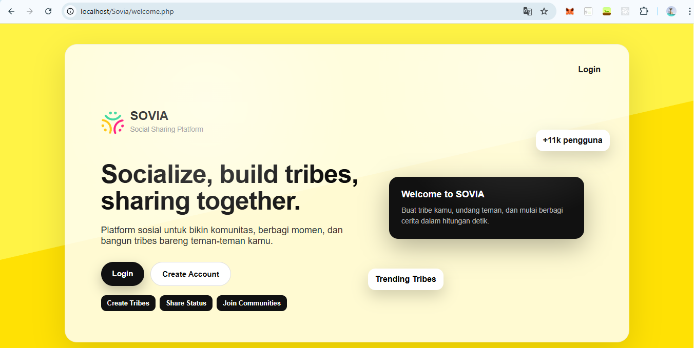

**Penjelasan Fungsi:**

- Menampilkan halaman landing page pertama kali pengguna mengakses aplikasi
- Menampilkan logo dan deskripsi aplikasi SOVIA
- Terdapat tombol **Login** untuk masuk ke aplikasi
- Terdapat tombol **Create Account** untuk registrasi pengguna baru
- Menampilkan tagline aplikasi: "Socialize, build tribes, sharing together"
- Menampilkan fitur-fitur utama: Create Tribes, Share Status, Join Communities

---

### 🔐 Halaman Login (auth/login.php)

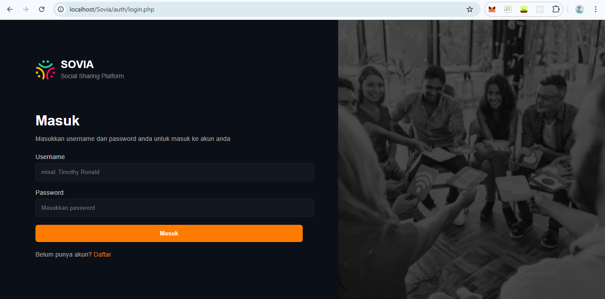

**Penjelasan Fungsi:**

- Form untuk login pengguna yang sudah memiliki akun
- Input field **Username** untuk memasukkan username pengguna
- Input field **Password** untuk memasukkan password pengguna
- Tombol **Login** untuk proses autentikasi
- Link ke halaman **Register** untuk pengguna yang belum memiliki akun
- Setelah login berhasil, pengguna akan diarahkan ke dashboard

---

### 📝 Halaman Register (auth/register.php)

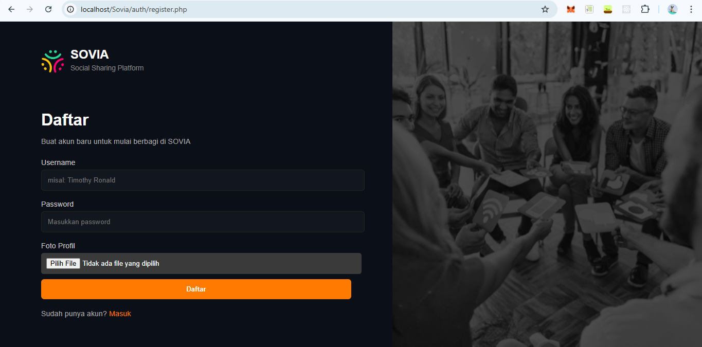

**Penjelasan Fungsi:**

- Form untuk membuat akun pengguna baru
- Input field **Username** untuk membuat username baru
- Input field **Password** untuk membuat password baru
- Input field **Confirm Password** untuk konfirmasi password
- Tombol **Register** untuk proses pendaftaran akun baru
- Link ke halaman **Login** untuk pengguna yang sudah memiliki akun
- Password di-hash menggunakan bcrypt untuk keamanan

---

### 🏡 Dashboard User (users/index.php)

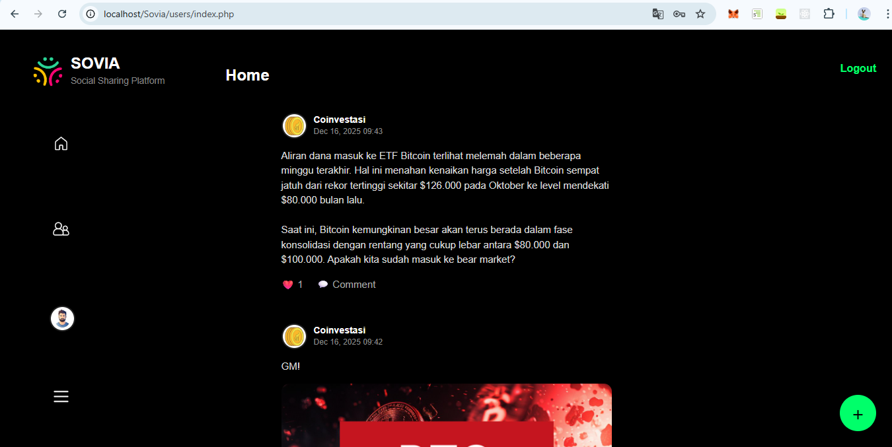

**Penjelasan Fungsi:**

- Halaman utama setelah pengguna login
- **Form Post Status**: Form untuk membuat postingan baru dengan input text dan upload gambar
- **Dropdown Select Tribe**: Memilih tribe tujuan untuk postingan (opsional)
- **Timeline**: Menampilkan semua status dari tribes yang diikuti pengguna
- **Status Card**: Setiap status menampilkan:
  - Avatar dan username pembuat status
  - Waktu posting
  - Konten status (teks dan gambar jika ada)
  - Nama tribe tempat status diposting
  - Tombol **Like** untuk menyukai status
  - Form **Comment** untuk menambahkan komentar
  - Tombol **Delete** untuk menghapus status (hanya status milik sendiri)
- **Navigation Menu**: Menu untuk navigasi ke halaman lain (Tribes, Logout, dll)
- Menampilkan jumlah likes dan komentar untuk setiap status

---

### 👥 Halaman Tribes (users/tribes.php)

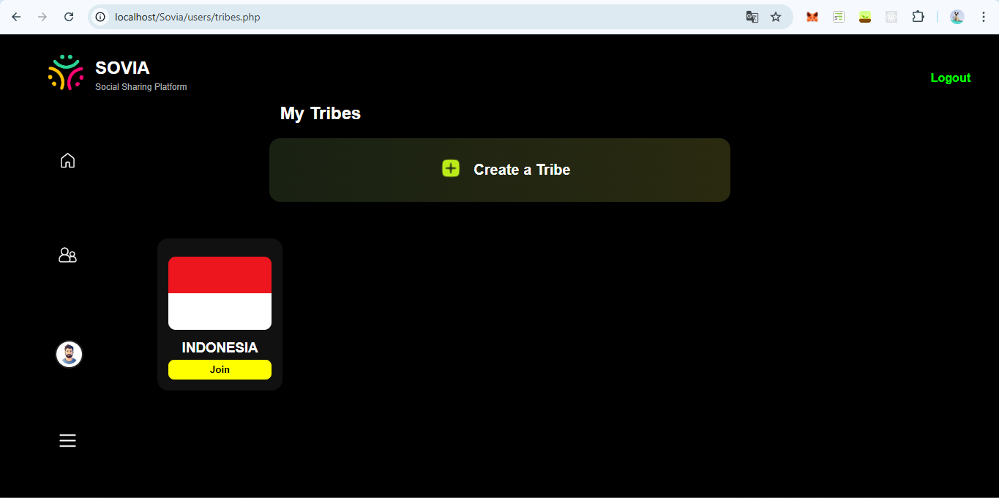

**Penjelasan Fungsi:**

- Menampilkan daftar semua tribes yang ada di platform
- **Tribe Card**: Setiap card menampilkan:
  - Gambar/logo tribe
  - Nama tribe
  - Jumlah anggota tribe
  - Tombol **Join Tribe** untuk bergabung (jika belum join)
  - Tombol **Unjoin Tribe** untuk keluar (jika sudah join)
- **Tombol Create Tribe**: Untuk membuat tribe baru
- Klik pada tribe card akan mengarahkan ke halaman detail tribe
- Menampilkan tribes yang sudah diikuti dan belum diikuti oleh pengguna

---

### 🎯 Halaman Detail Tribe (users/tribe_detail.php)

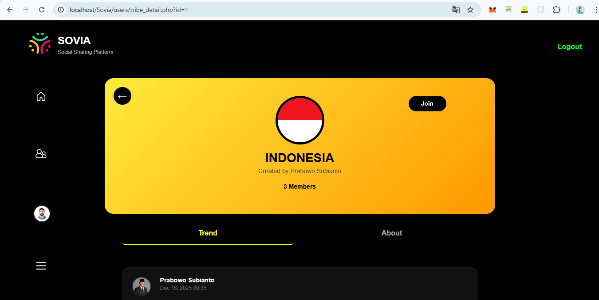

**Penjelasan Fungsi:**

- Menampilkan detail lengkap sebuah tribe
- **Header Tribe**: Menampilkan gambar, nama tribe, dan jumlah anggota
- **Tombol Join/Unjoin**: Bergabung atau keluar dari tribe
- **Form Post Status ke Tribe**: Form khusus untuk posting status ke tribe ini
- **Timeline Tribe**: Menampilkan semua status yang diposting di tribe ini
- **Daftar Anggota**: Menampilkan daftar anggota tribe dengan avatar mereka
- Setiap status di timeline memiliki fitur like dan comment
- Pengguna dapat melihat status yang diposting di tribe tersebut saja

---

### 👨‍💼 Admin Dashboard (admin/admin.php)

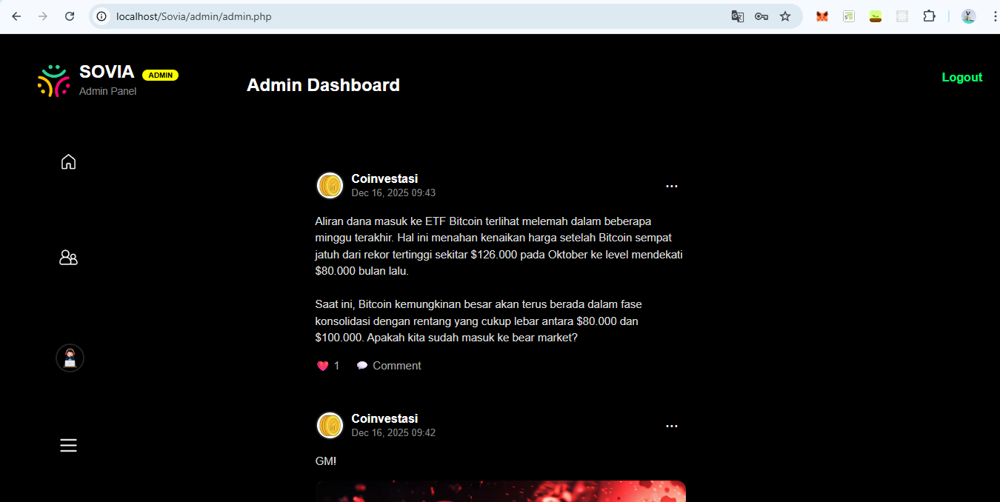

**Penjelasan Fungsi:**

- Halaman utama untuk administrator platform
- **Statistik Overview**: Menampilkan jumlah total pengguna, tribes, dan feedback
- **Navigation Menu Admin**: Menu untuk navigasi ke berbagai fitur admin:
  - Manage Users (kelola pengguna)
  - Manage Tribes (kelola tribes)
  - View Feedback (lihat feedback)
  - Create Admin (buat admin baru)
- Dashboard memberikan overview singkat tentang kondisi platform
- Hanya dapat diakses oleh pengguna dengan role "admin"

---

### 👥 Halaman Manage Users (admin/manage_users.php)

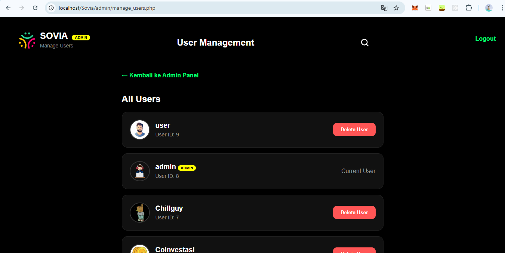

**Penjelasan Fungsi:**

- Menampilkan daftar semua pengguna yang terdaftar di platform
- **User List**: Setiap item menampilkan:
  - Avatar pengguna
  - Username pengguna
  - Role pengguna (user/admin)
  - Tanggal registrasi
  - Tombol **Delete** untuk menghapus pengguna
- Admin dapat melihat semua akun pengguna
- Admin dapat menghapus pengguna yang tidak diinginkan
- Menampilkan total jumlah pengguna di platform

---

### 🎯 Halaman Manage Tribes (admin/tribes_admin.php)

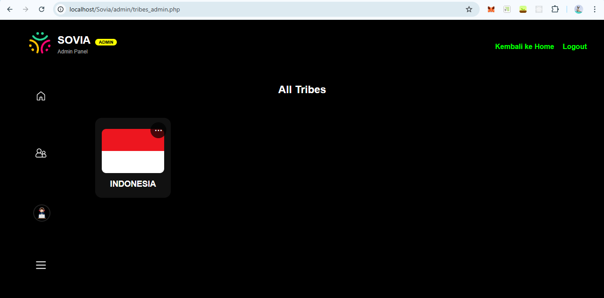

**Penjelasan Fungsi:**

- Menampilkan daftar semua tribes yang ada di platform
- **Tribe List**: Setiap item menampilkan:
  - Gambar tribe
  - Nama tribe
  - Dibuat oleh (username creator)
  - Jumlah anggota
  - Tanggal pembuatan
  - Tombol **View Detail** untuk melihat detail tribe
  - Tombol **Delete** untuk menghapus tribe
- Admin dapat melihat semua tribes
- Admin dapat menghapus tribe yang tidak sesuai
- Menampilkan informasi lengkap tentang setiap tribe

---

### 📋 Halaman Tribe Detail Admin (admin/tribe_detail_admin.php)

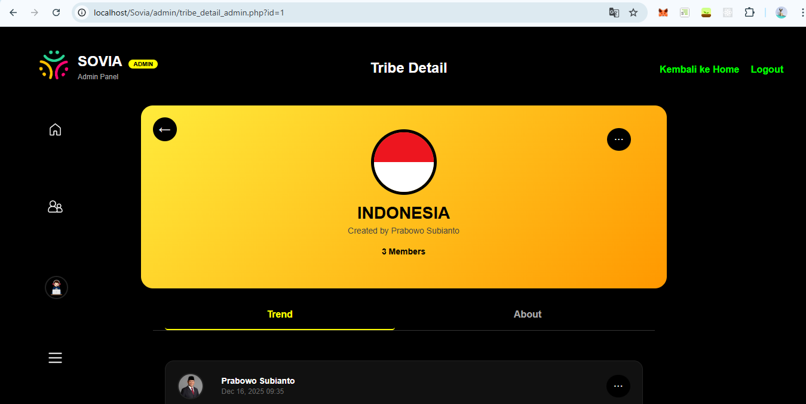

**Penjelasan Fungsi:**

- Menampilkan detail lengkap tribe dari sisi admin
- **Informasi Tribe**: Nama, gambar, creator, tanggal pembuatan
- **Daftar Anggota**: Menampilkan semua anggota tribe
- **Status di Tribe**: Menampilkan semua status yang diposting di tribe ini
- Admin dapat melihat semua informasi tentang tribe
- Admin dapat menghapus tribe dari halaman ini
- Menampilkan statistik anggota dan postingan dalam tribe

---

### 💬 Halaman View Feedback (admin/view_feedback.php)

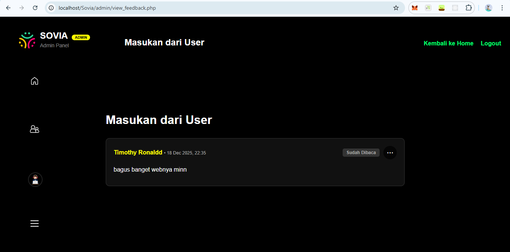

**Penjelasan Fungsi:**

- Menampilkan semua feedback yang dikirimkan oleh pengguna
- **Feedback List**: Setiap item menampilkan:
  - Username pengguna yang mengirim feedback
  - Pesan feedback
  - Tanggal dan waktu pengiriman
  - Status feedback (read/unread)
  - Tombol **Mark as Read** untuk menandai sudah dibaca
  - Tombol **Delete** untuk menghapus feedback
- Admin dapat melihat semua masukan dari pengguna
- Admin dapat menandai feedback yang sudah dibaca
- Admin dapat menghapus feedback yang tidak relevan
- Menampilkan jumlah feedback unread

---

## Penutup

Aplikasi SOVIA merupakan platform sosial sederhana yang memungkinkan pengguna untuk berinteraksi, membentuk komunitas, dan berbagi konten. Dengan adanya panel admin, platform ini dapat dikelola dengan baik untuk memberikan pengalaman terbaik bagi pengguna.

---

**Dibuat oleh:** Arif Yoga Pratama  
**Email:** arifyogapratama69@gmail.com  
**GitHub:** [@genzset](https://github.com/genzset)
